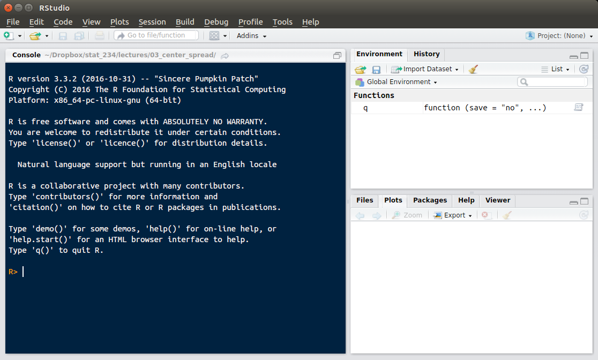
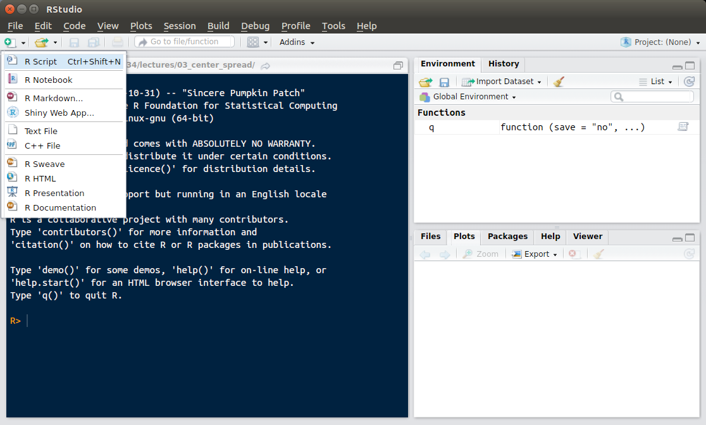
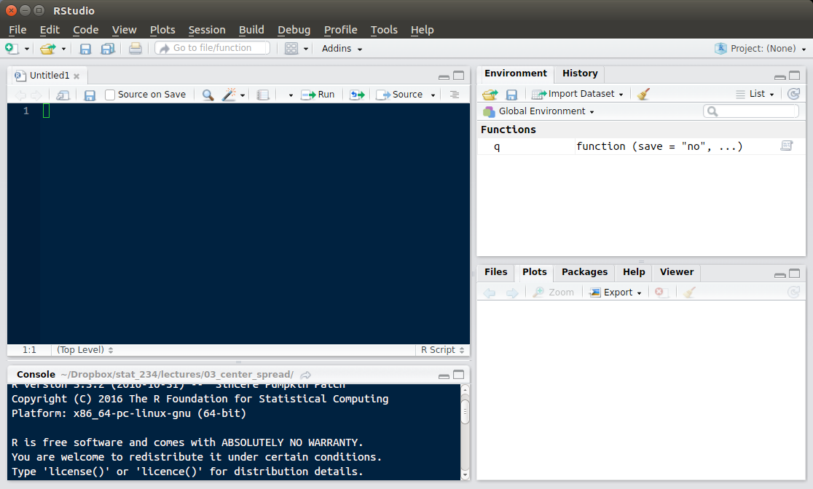

```{r echo=FALSE}
library(knitr)
opts_chunk$set(tidy.opts=list(width.cutoff=60),tidy=TRUE, fig.height = 2.5, fig.width = 4, fig.align = "center")
```

## Note on Authorship

The original notes were written by Sohail Nizam and were modified by David Gerard


## 1.1 Why Use R?

* R is free and open source 
* and looks great on your resume!
* It's popular since flexible and powerful
* ...so, of course, it appears complex.

* I'm here to make it a small learning curve. 
* Answers to most questions are one or two Google searches away. 
* I encourage you to just jump in and start trying things!
* If you do, you'll enjoy and understand HW more 


* You'll see that short lines of R code can be as easy as point and click in SPSS. 
* You can also perform more complex data management tasks as you would in SAS.

## 1.2 What is RStudio?

* RStudio is a free interface for R.
* RStudio makes working with R easier and more intuitive. 
* All of the work we do will be in RStudio. 

## 1.3 Downloading and Installing

Just go to [https://cran.rstudio.com/](https://cran.rstudio.com/) and follow the links. If you need help, you can watch some videos on YouTube:

- Install R on Windows: [https://www.youtube.com/watch?v=mfGFv-iB724&feature=youtu.be](https://www.youtube.com/watch?v=mfGFv-iB724&feature=youtu.be)
- Install R on Mac: [https://www.youtube.com/watch?v=Icawuhf0Yqo&feature=youtu.be](https://www.youtube.com/watch?v=Icawuhf0Yqo&feature=youtu.be)

To download Rstudio, go to the following link, download the appropriate installer, run the installer, and follow the prompts:

- [https://www.rstudio.com/products/rstudio/download/#download](https://www.rstudio.com/products/rstudio/download/#download) 


## 1.4 Your Most Important Resource

I'll do my best to demonstrate the skills you'll need over the course of the quarter. 
However, there is no way I can preemptively answer any question you may have about tasks in R. 
So let me take a moment to talk about your most important resource when using R: Google. 
I don't have every function or every method of data management/analysis memorized. 

That's not the important thing here. 
Once you have a basic understanding of the syntax and the way the language works, you can perform any task by simply knowing how to cleverly Google your problem. 
There's a good chance that someone has done what you want to do (or at least something similar) and has posted instructions online. 
Stack Exchange usually has great answers. 
 

## 1.5 The RStudio Interface


* There's no need to ever actually open R if you are using RStudio.
* R starts up automatically inside RStudio.
* So let's start by opening RStudio. 
* Your window should look like this (maybe with a different color theme).


\newpage

* You should see three or four panels on your screen. 
  * The Console, 
  * the Environment Window, 
  * the "Plots" panel (which has other tabs we may use)
  * ...and a "Source" panel (not yet visible)
* Always start by opening a new R script 
  * Click on the piece of paper with the green and white plus sign (top left) 
  * Select the first item in the dropdown: "R Script."
  

<br>


\newpage

* Voilà, the "Source" panel appears
* Now you have a fourth panel on the screen. 



\newpage

* This is your source code editor. 
* This is where you will type all of your R code.
* Output will appear in the Console window (below the editor)

 Let's demonstrate this by using one of R's most basic features. Among other things, R is a calculator and can perform arithmetic operations. Below we see the syntax used to add, subtract, multiply, divide, and exponentiate respectively in R.
 
* The following will be typed in the Source panel.
* NOTE: everything in a gray box belongs in your Source panel
 
```{r include = FALSE}
1+1
5-1
2*3
10/5
5^2
```


* To perform those operations, we have to run the code. 
* You can run R code line by line or in chunks. 
* To run one line of code, place the cursor anywhere on that line and then click the button that says "Run" in the top right corner of the Source panel. 
* To run several lines at once, highlight them and click Run.
* On mac there is a shortcut for Run: Command+Enter
* On windows the shortcut for Run: Control+Enter

* When we run the code shown above, we see that the code we typed and the output corresponding to that code appears in the Console.

```{r}
1+1
5-1
2*3
10/5
5^2
```


* The output directly above should be in your Console

Note: Code can be run in the Console but this is a use it and lose it mode of operation. Modifying and re-running code becomes very inconvenient. In your classes you will be expected to provide R code as well as output. If you type your code in the Console this will be very difficult. Likewise, if you want to stop working on your code and come back to it later, closing Rstudio will wipe everything in the console whereas the R script can be saved.

* The Environment Window shows the name and data type of every object you create. 
* For the most part this will mean vectors and data frames. 
* Use of the Environment Window will become clearer in the next section

## 1.6 Variable Assignment

* When we get into the weeds with our work in R, we start to have a lot of different values to save. 
* We'll have vectors and data frames, important single data values, various statistics, ouput results, and more. 
* We need an easy way to keep track of and refer to all of these values and objects.

* In R we can assign any value to a variable with a name of our choosing. 
* We can refer to variables later at our convenience by typing that name.

* As an example, let's say we are interested in the value of an arithmetic operation, and we want to save it for later. 
* I'll call this variable `x` 
* In the code chunk below, first is the operation typed so R can solve it, and second is that same operation saved under the name `x`. 

```{r tidy=TRUE}
((4+5)/(3^2))*7
x<- ((4+5)/(3^2))*7
```


* Notice I didn't type `=`
* In R, the convention is to use this two character combination: `<-`

* Try copying and running each of those lines separately. 
* Notice that, as before, the first line just returns `7` in the Console. 
* However, when we run the second line, the only thing displayed in the console is the code itself with no output. 
* Instead, we see a change in the Environment window. 
* Under the "Values" header, we see that `x` has been assigned the value `7`. 
* We can now refer to that value by typing `x` 
* Let's assign another value to `y` and see what the product of `x` and `y` is. 
* Run the first line to set `y`, and run the second line to produce our answer in the Console.

```{r}
y <- ((4^3)/(5 * 3)) + 10
x*y
```

* Say you want to output the exact value you previously assigned to a variable. Maybe because you need to copy this number and paste it in some homework (you can't copy values from the Environment window).
* This is known as "calling" a variable. 
* To call a variable, just type the name of the variable and run it. 

```{r}
x
```

### A note on usefulness and coding practice:
Variable assignment becomes very useful when we have to write long pieces of code with many components that refer to different data sources. Instead of putting down a huge indesipherable piece of code, we can layer it by assigning smaller operations to variables and then referring to the variable names in the code. I'll show an example of this once we learn about some more objects in R and start working with some data.

It's good practice to choose variable names that succinctly describe the value you are saving. For example, later in the quarter you'll be covering linear regression. There's a certain function that ouputs all the information you could possibly want after you run a regression. When I'm doing just one regression I save all this output under the name `my_Reg`. Or maybe I'm running three regressions: one involving Body Mass Index, one involving Systolic Blood Pressure, and one involving weight. I might call those `BMI_reg`, `SBP_reg`, and `Weight_reg` respectively. Variable names cannot have spaces, and they cannot begin with a number. It can be easy to forget what purposes your variables serve when save too many under non-descript names. 

Also, I would advise against choosing variable names which are the same as the names of built in functions in R. For example, there's a function you will be using quite often called mean(). If you have to calculate it a mean and save it, I would call it something besides "mean." Things could get confusing if you don't. You can check a name to see if it is a function by typing it into the Console and hitting enter.

That leads me to another note on coding practice....


## 1.7 Comments

No matter what language you are using, it's always important to leave yourself comments so you can come back to the code later and still remember what you were trying to do. Start doing that now when the code is simple, and you'll have developed a good habit by the time you start writing more complex scripts.

* To leave a comment in R, use the # sign as shown below. 
* Anything to the right of a # on the same line will be commented out.

```{r}
#This is a comment. This will not influence any code I wish to run.
```

You can add comments above or next to your code.

```{r}
c<- 5 #This code assigns the value 5 to the variable c.
```


## 1.8 Vectors

In statistics we deal with data. To manage and analyze data in R, we need a way to store those data. 

* The most basic and useful way to store data is in a vector. 
* A vector is a sequence of data elements. 
* It's tempting to use the word "list" to describe it, however a List is actually a very specific thing in R. Lists have different functionality, and for our purposes are much less useful.
 
* Vectors are great because we can perform opertations on every single value in a vector without iterating through it. 
* For those of you who have used Python before, you might be used to writing for-loops to work on values in a list.  That's not necessary here. 
 
* Vectors are created in R using the `c()` function. 
* "c" stands for concatonate, which means stick together. 

### A note on functions:
There's a general way that all functions are used in R. The name of the function is followed by parentheses. Inside the parentheses we type the input that the function takes. I'll go more into the use of functions later on. For now, just know that the function you need to create a vector is called "c" and it us used in the following way.
 
 
```{r}
vec<- c(5,3,5,6,7,2)
```


* This line creates a vector out of the integers 1 through 5. 
* Think of this as a column of data. 

Normally in a dataset you will have observations for several variables. The observations of a given variable will consitute a column(variable) in your dataset. 

* Here variable assignment becomes important.
* We want to save that vector, but we can't type out all of the numbers each time. 
* We can save a vector as a variable just like we can save a number.

```{r}
vec<- c(5,3,5,6,7,2) #This line saves 5,3,5,6,7,2 as a vector
vec #This line calls that vector so the numbers are displayed in the console
vec*2 #multiply every element in vec by 2
vec^2 #square every element in vec
```

* As I mentioned, you can perform operations on every value in a vector. 
* Let's say you have a vector of years and you want to shift it (something that might become useful in regression). 
* You could take the earliest year in your vector and subtract that number from each number in the vector, like so:

```{r}
year<- c(1985, 1987, 1993, 1994, 1999, 2006, 2007, 2008, 2010) #create date vector
year_st<- year-1985 #shift
year_st #call shifted vector
```

## 1.9 Different Data Types

* The types of data you should concern yourself with are: numeric, character, logical, and factor.
* Below are vectors of each type (except factor).
* Run each line and check the envoronment window to confirm the type

```{r eval=FALSE}
num_vec<- c(1,2,3,4) #numeric vector
num_vec2<- c(1.3, 4.7, 6.3, 5.2) #another numeric vector
char_vec <- c("yes", "no", "maybe", "notsure") #character vector
logical_vec<- c(TRUE, FALSE, TRUE, FALSE) #logical vector
```

* Numeric covers continuous and discrete data
* A character vector is a vector of strings (values in quotes)
* Logical data is either TRUE or FALSE. Notice they are all caps and have no quotes.

*Logical is useful for binary data. To understand the name, consider the following lines of code and their output.


```{r}
1==1
1==2
```


* These lines ask R to evaluate a statement for truth. 
* The first one returns TRUE because 1 is equal to 1.
* The second one returns FALSE because 1 is not equal to 2.

* One more interesting feature of logical operators: TRUE is assigned the value 1 and FALSE is assigned the value 0.
* Say you have a vector of logical values. To find the number of TRUEs you can take the sum of the vector (using the sum() function).

```{r}
logical_vec<- c(TRUE, FALSE, TRUE, FALSE)
sum(logical_vec)
```
  
* The sum is 2 because there are 2 TRUEs.

### Factor variables and Coercing

* When dealing with categorical data, it might be useful to treat them as Factors.
* A Factor is saved as a vector of integers where each integer corresponds to a character value.
* Factors make storing character vectors more efficient since every string is only saved once.
* Because of this, when you import character data, R will convert it to a factor.
* You won't be dealing with high dimensional data, and storing efficiency should not concern you. 
* For this reason, you have no need to create Factor vectors.
* Unfortunately, we can run into problems when dealing with Factors. 
* Since your imported data will contain factors it may be useful to know how to convert factors to characters.

```{r eval=FALSE}
#Say fac is a factor vector.
#We convert to character with this code:
as.character(fac)
```

* We could also change a vector of numbers to a vector of characters using the `as.character()` function.
* Likewise we can convert character to numeric with `as.numeric()`
* To convert factor to numeric we must first convert to character

```{r eval=FALSE}
#convert fac to numeric
as.numeric(as.character(fac)) 
```

## 1.10 Referring to Values and Finding Vector Length 

* There may come a point where you need to find out what the ith value of a certain vector is. 
* You can find that using square brackets.

```{r}
year
year[5] #This gives us the 5th value in the year vector
```

*Note, indices in R start at 1, not 0 as in some langauges.

* You may also need to find the number of values in a certain vector. 
* Do this using the `length()` function.

```{r}
my_vec<-c(1,2,3,4,5,6,7,8,9,10,12,234,534,123,645,42,345,547,867)
my_vec
length(my_vec)
```

## 1.11 Data Frames

* Usually we have more than one column(variable) in our data set. 
* So how can we store several vectors together? 
* We'll use something called a data frame. 
* It's important to think of a data frame as a collection of columns, not a collection of rows because *that's how R thinks of it*. 
* When you have a data frame, you can easily refer to specific columns.
* But refering to rows becomes more complicated.

* Just like vectors are created with the `c()` function taking a collection of elements of the same type as input, data frames are created with the `data.frame()` function taking a collection of vectors as input. 
* The vectors can be of differing data types. 

Let's play around with a dataframe from the `mtcars` dataset. To see a description of these data, type
```{r, eval = FALSE}
help(mtcars)
```

We can load in these data with the `data` function
```{r}
data("mtcars")
```


If you have a relatively small data set, and you just want a cursory look at the data, printing the data frame in the Console (my just typing `mtcars`) may suffice. However, if you have many columns and many rows, viewing your data in the console will be very difficult. 

Instead, we can take a look at the data in a nice table in a new Rstudio tab using the View() function. 

* `View()` takes the name of a data frame as an argument. 
* Please note, `view()` is incorrect. The V must be capitalized.

```{r eval= FALSE}
View(mtcars)
```

* ANOTHER NOTE: running this function requires the installation of another package called xquartz. So don't try to run this yet. I will explain how to install packages later.


* More than likely, when you recieve data to work with, it will be in the form of a data frame. 
* So once you have a data frame, how can you examine individual columns? 
* The syntax is very simple. To refer to one column simply type the name of the data frame and the name of the column seperated by a $. For example:

```{r}
mtcars$mpg #calls the mpg column of our data frame
```

* One nice thing about Rstudio is that it has a suggestion feature. 
* If you've saved a data frame, when you type its name and the dollar sign, a dropdown with all of the possible columns should appear for you. 
* If the dropdown does not appear, try pressing tab.

* Maybe you just want all of the column names displayed for you. 
* For that you can use the `names()` function. 
* `names()` takes a data frame as input and outputs a vector comprised of that data frame's column names.

```{r}
names(mtcars)
```

* Now let's use what we know about indexing to rename the first column. 
* We know that `names(mtcars)` represents a vector. 
* So let's refer to the first element of that vector and set it equal to something new. 

```{r}
names(mtcars)[1] = "mpg2" #rename the first column
names(mtcars) #display the new names vector
```

* Here are some more useful functions for data frames:

```{r}
head(mtcars, 15) #see the first 15 rows of the data frame
tail(mtcars, 9) #see the last 9 rows of the data frams
```

We'll go into more depth on what to actually do when you get some data in a couple of sections.

* While your data sets will be in the correct format, I'm unhappy with my `am` variable here that groups cars into `automatic` vs `manual`.
* I'm going to change `am` values to `"A"` and `"M"`
```{r}
mtcars$am <- as.factor(mtcars$am)
levels(mtcars$am) <- c("A", "M")
```

## 1.12 Importing Data (From File)

* You're told that data are stored in some file for you to download. 
* How do you get those data into R?

* If it is a .xls or .xlsx file I would suggest saving it as a .csv file first. 

* Next, I would reccomend setting your Working Directory. 
* If you set your Working Directory it allows you to avoid writing the full pathway to the file on your computer when you import.

* To set your Working Directory, click "Session" on the tool bar.
* A dropdown menu will appear. Hover over "Set Working Directory". 
* Finally, click "Choose Directory." 
* A finder/explorer window will open. 
* Navigate to the location of your saved data.

* To import the data in the file, write this line of code:

```{r eval=FALSE}
MyData <- read.csv(file="FileName.csv", header=TRUE, sep=",")
```

* If you choose not to set your working directory, you will have to include the full pathway to the file in the code.

* Notice that for the first time we have a function with more than one piece of input (AKA "argument"). 
* When dealing with functions that take more than one argument, each argument is separated by a comma. The first argument is the name of your file. 
* The second argument calls for either header=TRUE or header=FALSE. 
* We write header=TRUE if the first row of our data consists of column names rather than actual data. 
* You have to take a look at the data beforehand to determine whether the data includes headers.
*The third argument tells R how the data are separated in the file. In this case we're working with a csv file so the data values are comma separated. Data may be separated by spaces or tabs.


## 1.13 Importing Data (From URL)

* If you have a url for the csv file, simply place it as the `file` arguement in `read.csv()`. For example, to download a dataset on Donald Trump's tweets, type:

```{r eval=FALSE}
trump <- read.csv(file="https://github.com/dcgerard/stat234/raw/master/data/trump.csv")
```

You can read about these data here:

- \url{https://dcgerard.github.io/stat234/datasets.html#trumpcsv}

## 1.14 Installing Packages

### Another note on functions
You haven't learned much statistics yet, so I'm not going to go into complex topics here. However, to get you started doing simple analyses and becoming more familiar with R, I will show some common functions for descriptive statistics below. Remember, every R function has a name and takes input inside a set of parentheses. Another name for a function input is an "argument" (eg. `names()` takes a data frame as an argument). As you will see, most useful functions have many potential arguments, and arguments have specific syntax just like anything else.

### R packages
R comes with something called a base package. It's just a set of functions that the creators of R figured almost everyone would need. R comes pre-loaded with all of these functions. For instance, you don't need to download anything to calculate a mean or a standard deviation because R has `mean()` and `sd()` loaded in the base package. However, you can't do everything you want to with base R. There are a lot of of different "libraries" (also known as "packages") of extra functions that others have written and shared online. You generally just find them by Googling what you want to do (e.g. "plotting maps in R" or "cowsay in R").

### Code Install (One Time)

* You can install a package by using the `install.packages()` function.

```{r eval=FALSE}
install.packages("cowsay") #install cowsay pckg
```

* If you want to install multiple packages at one time, `install.packages()` can take a vector as an argument.
* Below are several other packages that might turn out to be useful. 

```{r eval=FALSE}
install.packages( c("mosaic", "Hmisc", "fastR", "rmarkdown", "car", "vcdExtra", "Lock5withR", "tidyverse") )
```


### Load Packages Into Library

* To load a package in R, use the `library` function.
* Sometimes, people will say to use the `require` function instead of `library`, [\textcolor{red}{they know not what they say}](https://yihui.name/en/2014/07/library-vs-require/). Use `library` instead.

```{r}
library(cowsay)
say("I am a cow.", "cow")
```

* Type now
```{r}
library(tidyverse)
```
* This package has a useful summary function (`glimpse`) that we will be using shortly.
* Notice that there is a whole slew of red output when you load a package sometimes. This is normally OK as long as you don't see "ERROR".
* Don't worry about any of these other packages for now. 

### Point and Click Install

* We can perform the same task with a point and click method in the Rstudio interface
* Finally we get to use the fourth window. However we won't use it for a plot. 
* Right next to the tab that says "Plot" is a tab that says "Packages." 
* Click "Packages", and then click the "Install" button below. 
* A new window will pop up with a search bar. 
* Search for "cowsay" and click "Install." 
* You should see a bunch of red output ending with something like "downloaded 6.2 MB." 

* Your last step is to run that same code to put the installed package into your library.

```{r eval=FALSE}
library(cowsay) 
```

* Alternatively, we could go back to the Packages tab, search for the package, and select the box next to it to load it into the library.


### Detach a package

* If you want to stop using a package (for instance you want to go back to the base functions which some packages overwrite), you can detach it.
* Type this code:

```{r eval=FALSE}
detach(cowsay)
```

* Or search for the package in the Packages tab and deselect the corresponding box

##1.15 Descriptive Statistics and Function Syntax

* When you recieve data, the first thing to do is examine the structure of the data.
* Here are some functions you might find useful. 
* Notice, I'm using the data frame I created a few sections ago. Take a look at what each one produces.

```{r eval=FALSE}
glimpse(mtcars) #gives info on variable names, types, and values
summary(mtcars) #gives a 5 number summary of each column
head(mtcars, 10) #shows the first 10 rows of the data (can use different number)
tail(mtcars, 5) #shows the last 5 rows of the data (can use different number)
```

* Let's consider measures of center and spread.

```{r}
mean(mtcars$mpg2) #find the mean of the mpg2 variable
#find the mean of mpg2 for automatic and manual separately
aggregate(mtcars$mpg2, by = list(mtcars$am), FUN = "mean") 
mean(mtcars$mpg2[mtcars$am == "M"]) #find the mean of mpg2 only for manual
```

```{r eval=FALSE}
sd(mtcars$mpg2) # find the standard deviation of mpgs.
#find the standard deviation of mpgs for automatic and manual separately
aggregate(mtcars$mpg2, by = list(mtcars$am), FUN = sd) 
sd(mtcars$mpg2[mtcars$am == "M"]) #find the standard deviation of mpg2 only for manual
```

Now how about median and IQR:

```{r}
median(mtcars$mpg2) #find the median of mpg2
IQR(mtcars$mpg2) #find the interquartile range of mpg2
```


We can compute each piece of the five number summary individually using these functions:
```{r}
min(mtcars$mpg) #find the minimum value of mpg2
quantile(mtcars$mpg, probs = 0.25) #find the first quartile (25th percentile)
quantile(mtcars$mpg, probs = 0.5) #second quartile (50th percentile AKA median)
quantile(mtcars$mpg, probs = 0.75) #third quartile (75th percentile)
max(mtcars$mpg) #maximum value
```

Note you can use the `quantile()` function to find any quantile you want, not just those in the five number summary.

Another useful function is `summary()`. It gives you a five number summary and the mean.

```{r}
summary(mtcars$mpg)
```

##1.16 Graphical Representations

We'll use the ggplot2 package in R to do graphics in this class. Install ggplot2 if you haven't already
```{r, eval = FALSE}
install.packages("ggplot2")
```
Then load it so we can use its functions
```{r}
library(ggplot2)
```


* There are many functions to make graphical representations of data.
* We can add extra arguments to these functions to stylize our graph and make it presentable.


Boxplots and histograms are good for examining continuous variables.
```{r}
#this function uses the 1.5*IQR rule for outliers
qplot(y = mtcars$disp, 
      geom = "boxplot")
## separate boxplots for manual and automatic
qplot(x = factor(mtcars$am), 
      y = mtcars$disp, geom = "boxplot") 

#histogram for disp
qplot(x = mtcars$disp, geom = "histogram",
      xlab = "Displacement",
      ylab = "Frequency",
      main = "Distribution of Displacement",
      bins = 30)

## Create facets by am
qplot(x = disp,
      data = mtcars,
      geom = "histogram",
      xlab = "Displacement",
      ylab = "Frequency",
      main = "Distribution of Displacement",
      bins = 10,
      facets = factor(am) ~ .)
```

* When creating a histogram you may wish to change the number of intervals used.
* The default number may not be the best way to view the data. 
* We can change the intervals by adding another argument called `bins`

```{r}
qplot(x = mtcars$disp, geom = "histogram",
      xlab = "Displacement",
      ylab = "Frequency",
      main = "Distribution of Displacement",
      bins = 20)
```

Scatterplots are good for examining the relationship between two continuous variables.
```{r}
qplot(mtcars$disp, 
      mtcars$mpg, 
      xlab="Displacement", 
      ylab="MPG",
      main="Displacement vs MPG")
# one plot, different color for automatic and manual
qplot(mtcars$disp, 
     mtcars$mpg, 
     col= factor(mtcars$am), 
     xlab = "Displacement", 
     ylab = "MPG")

```

Cars with larger displacement tend to have lower miles per gallon. Also, automatic cars tend to have lower MPG than manual cars, but this is probably mostly explained by the fact that automatic cars tend to have higher displacement.

* Finally let's examine a dot plot. 

```{r}
qplot(mtcars$disp, geom = "dotplot")
```


* There are many different functions with many different arguments. 
* There's no need to try and memorize all of them. You wouldn't be able to anyway.
* Should you want to know the basics of what a function does, you can start by running the help function.

```{r, eval = FALSE}
help(sort) # find out what the sort() function does
# or
?sort
```

* When you run this, something appears in the fourth window. 
* It's the same window which displays plots, but now the help tab is selected. 
* The window displayed is an article which tells what the function does and all of the possible arguments it can take.


## 1.17 Exporting Plots

You'll need to save the plots you produce and put them in your homework. This is very simple in Rstudio. I'll walk you through the steps here.

First create your plot. 

Now in the plots window, click the button that says "Export." A dropdown will appear. You can select "Save as Image." A window will appear where you can select a location and name the file. If you previously set your Working Directory, the default location will be the location you set. The file will be on your computer, and you can easily insert it into a Word doucment. (Insert-->Picture-->From File).

You could also take a screenshot of the graph (Command+Shift+4 on mac).
